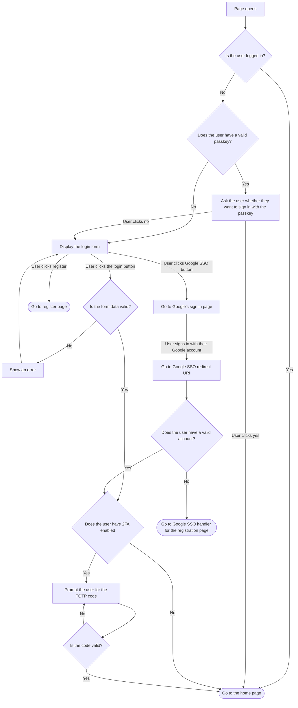

# Login Flows

The login process checks 
- whether the user is logged in
- whether the user authorised a valid passkey
- whether the user enters a valid credential pair (and if they enter their 2FA code correctly)
- whether the user has a valid account via SSO (and if they enter their 2FA code correctly)

If any of these conditions are satisfied, the user is logged in.

## Flowchart

## Limitations
- Only covers Google SSO, since other providers have a similar user flow.
- The login flow doesn't consider multiple incorrect credential attempts.
- The flow does not include an option for a forgotten password.
- The flow does not redirect users back to the page where they came from, instead opting to redirect them to the home page.