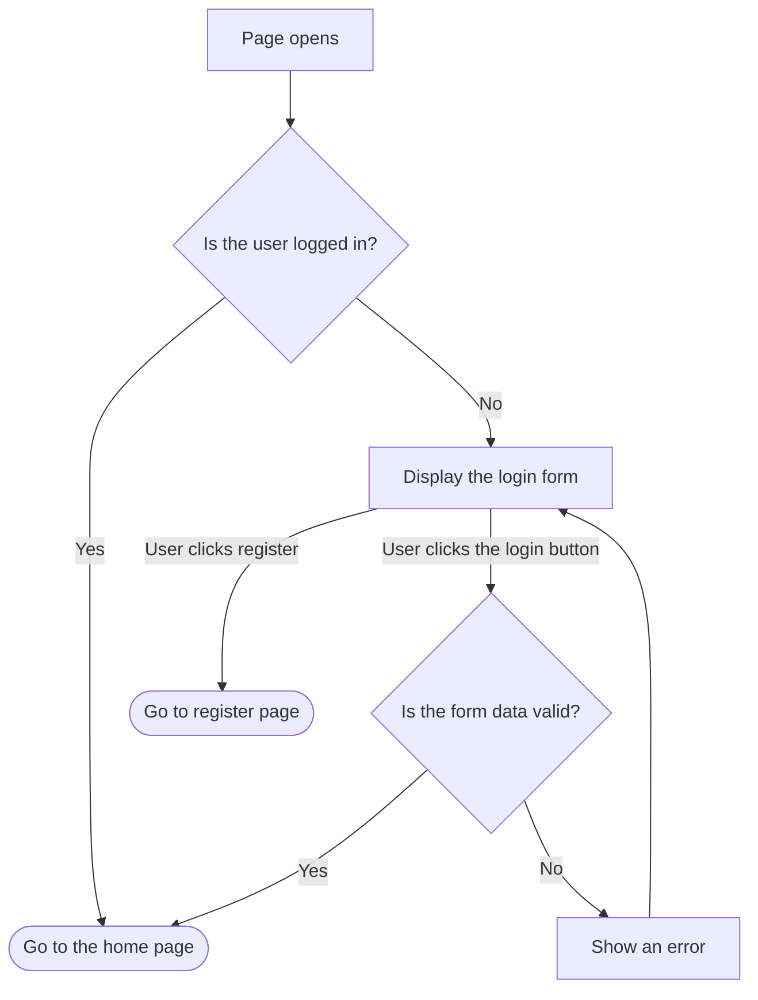

# Login Flows

## Flowchart

```mermaid
flowchart TD

    A[Page opens] --> B{Is the user logged in?}

    B -->|Yes| C([Go to the home page])

    B -->|No| D[Display the login form]

    D -->|User clicks the login button| E{Is the form data valid?}

    E -->|No| F[Show an error]

    F --> D

    E -->|Yes| C

    D -->|User clicks register| G([Go to register page])
```

## Limitations